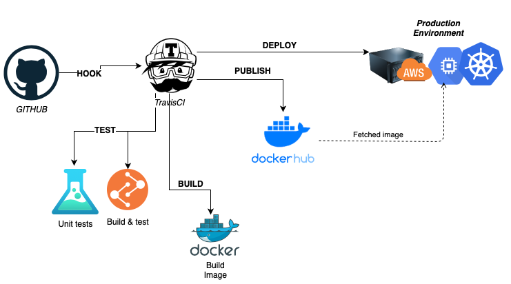

# gotest 

Simple http server written in Go
## Overview

This is a boilerplate written in Go for http endpoints.

* Dockerised service written in Go.
* CI Pipeline which triggers on push to master branch

## Architecture

Continuous Integration Architecture

## Processes

List of the processes used.

| Requirement       | Tech or Process                                              |
| ----------------- | ------------------------------------------------------------ |
| Development Model | [Acceptence Test Driven Development](https://en.wikipedia.org/wiki/Acceptance_test%E2%80%93driven_development) |
| Branching Model   | [GitHub Flow](https://githubflow.github.io/) |
| Versioning        | [Semantic Versioning](https://semver.org/)                   |

## Technologies

List of the technologies used.

| Requirement                 | Tech or Process                                              |
| --------------------------- | ------------------------------------------------------------ |
| Language                    | [Go](https://golang.org/doc/) |
| Dependency Management       | [go.mod](https://golang.org/doc/modules/gomod-ref) |
| Linters                     | [go lint](https://github.com/golang/lint) |
| Formatter                   | [gofmt](https://golang.org/cmd/gofmt/) |
| Testing Framework           | [go test](https://golang.org/doc/code#Testing) [go mock](https://github.com/golang/mock)|
| SCM                         | [Github](https://github.com/) |
| Packaging                   | [Docker](https://www.docker.com/) |
| CI Pipeline                 | [travis CI](https://travis-ci.org) |

## Project structure

## Development

## Limitations and risks
status endpoint is not formatted, it's just a json at the moment.
if it were to have users manually checking i would format it, if just for scrapers to look, id leave as is.

because the need of setting up the metadata for the docker image(image labels), the METADATA processing is being done on a shellscript and passed as parameters to docker so it could be set as docker label.

As there doesnt seem to be a limitation on the tags/releases with the same number, i've followed the semantic version as much as i could and added a suffix to the tag names of the short git commit sha. example: v1.0.0-QWERTY and v1.0.0-YTREWQ are acceptable tags
this was done to try and prevent conflicting tags and release numbers.

At the moment there is no automatic semantic versioning done by the pipeline once application is released/merged into main. This would be a good implementation to add into the release phase of the pipeline.
